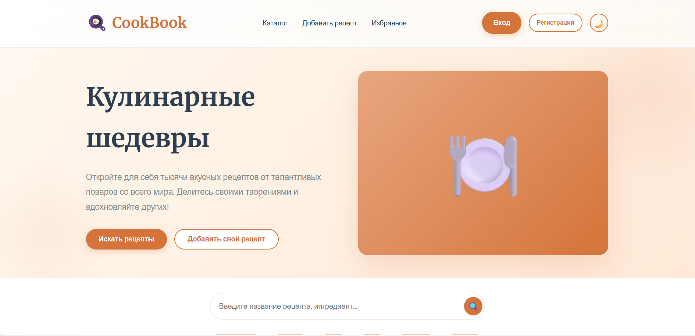
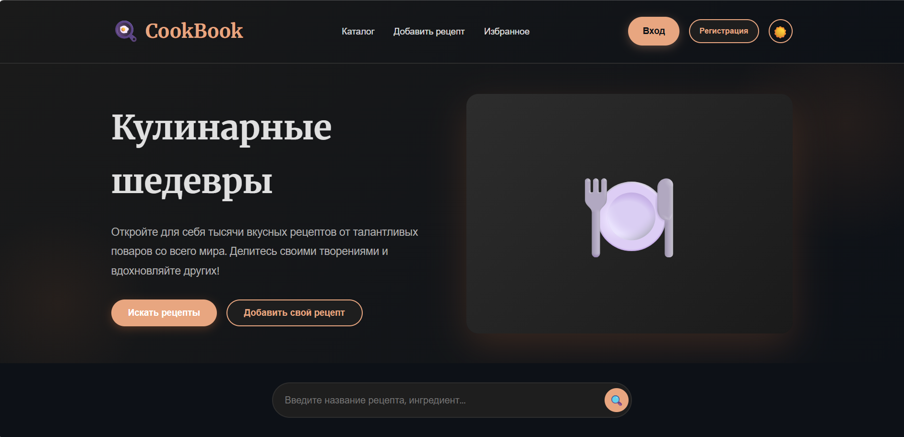
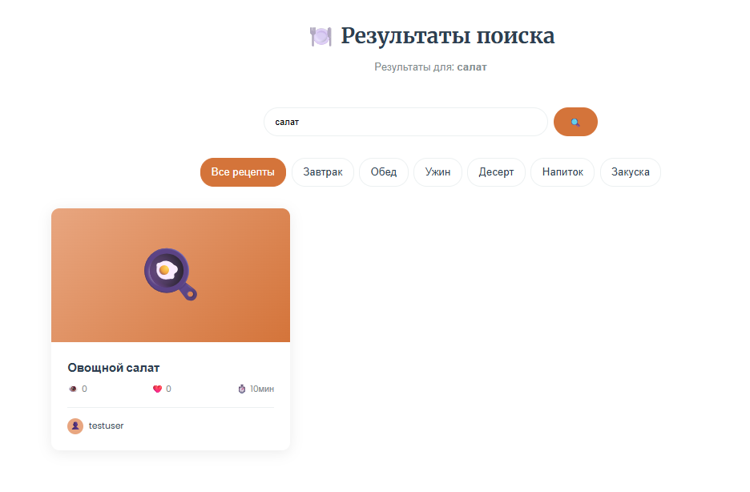
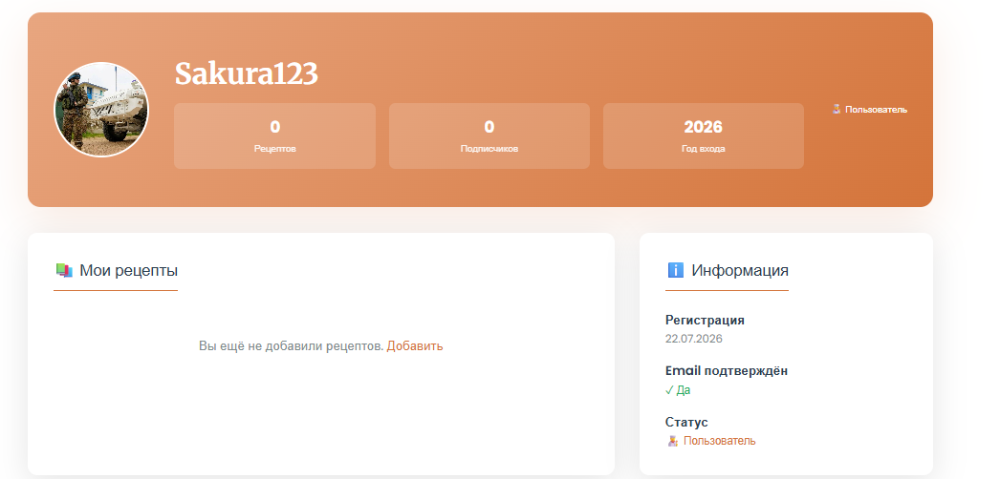

# 🍳 CookBook - Платформа для обмена рецептами

**CookBook** — это современное веб-приложение для управления рецептами, построенное на Django. Пользователи могут добавлять свои рецепты, искать рецепты других, лайкить и просматривать коллекции блюд.

## 📸 Скриншоты

| Скриншот                                                  | Описание |
|-----------------------------------------------------------|---------|
|          | 🏠 Главная страница со светлой темой и карточками рецептов |
|             | 🌙 Тёмная тема с элегантным чёрным дизайном |
|  | 🔍 Мощный поиск и фильтрация по категориям |
|  | 👤 Личный профиль с рецептами и статистикой |

Подробное описание скриншотов: [SCREENSHOTS.md](SCREENSHOTS.md)

## ✨ Возможности

### 🔐 Аутентификация
- ✅ Регистрация новых пользователей
- ✅ Вход в систему
- ✅ Безопасный выход из аккаунта
- ✅ Управление профилем

### 📚 Управление рецептами
- ✅ Создание новых рецептов с фото и подробным описанием
- ✅ Редактирование рецептов (только администраторы)
- ✅ Удаление рецептов (только администраторы)
- ✅ Просмотр рецептов с информацией об авторе
- ✅ Счётчики просмотров и лайков

### 🔍 Поиск и фильтрация
- ✅ Полнотекстовый поиск по названию, описанию и ингредиентам
- ✅ Фильтрация по категориям:
  - 🥐 Завтраки
  - 🍽️ Обеды
  - 🌆 Ужины
  - 🍰 Десерты
  - 🥤 Напитки
  - 🍿 Закуски

### 🎨 Пользовательский интерфейс
- ✅ Современный, отзывчивый дизайн
- ✅ **Тёмная тема** с сохранением выбора
- ✅ Адаптивный интерфейс (мобильные устройства, планшеты, ПК)
- ✅ Красивые карточки рецептов
- ✅ Плавные переходы и анимации

### 👤 Профиль пользователя
- ✅ Личная страница с информацией о пользователе
- ✅ Галерея собственных рецептов
- ✅ Статистика (количество рецептов, дата регистрации)
- ✅ Избранные рецепты

### 🔧 Администрирование
- ✅ Django Admin панель для управления контентом
- ✅ Редактирование и удаление рецептов
- ✅ Управление пользователями
- ✅ Управление категориями

---

## 🚀 Установка и запуск

### Требования
- Python 3.8+
- pip
- virtualenv (рекомендуется)

### Шаги установки

1. **Клонируйте репозиторий:**
```bash
git clone https://github.com/yourusername/cookbook.git
cd cookbook
```

2. **Создайте виртуальное окружение:**
```bash
python -m venv .venv
.venv\Scripts\activate  # Windows
source .venv/bin/activate  # macOS/Linux
```

3. **Установите зависимости:**
```bash
pip install -r requirements.txt
```

4. **Примените миграции БД:**
```bash
python manage.py migrate
```

5. **Создайте суперпользователя (администратора):**
```bash
python manage.py createsuperuser
```
Введите:
- Username: `admin`
- Email: `admin@example.com`
- Password: `ваш_пароль`

6. **Запустите сервер разработки:**
```bash
python manage.py runserver
```

7. **Откройте в браузере:**
```
http://localhost:8000
```

8. **Доступ к админ-панели:**
```
http://localhost:8000/admin/
```

---

## 📁 Структура проекта

```
cookbook/
├── main/                      # Основное приложение Django
│   ├── migrations/           # Миграции БД
│   ├── templates/main/       # HTML шаблоны
│   │   ├── base.html         # Базовый шаблон (навигация, тема)
│   │   ├── index.html        # Главная страница
│   │   ├── recipes_list.html # Список рецептов с поиском
│   │   ├── recipe_detail.html# Страница рецепта
│   │   ├── add_recipe.html   # Форма добавления рецепта
│   │   ├── edit_recipe.html  # Форма редактирования рецепта
│   │   ├── delete_recipe.html# Подтверждение удаления
│   │   ├── profile_new.html  # Профиль пользователя
│   │   ├── register.html     # Регистрация
│   │   └── login.html        # Вход в систему
│   ├── models.py             # Модели данных (User, Recipe, Profile)
│   ├── views.py              # Функции-контроллеры
│   ├── forms.py              # Формы для рецептов
│   ├── urls.py               # URL маршруты
│   └── admin.py              # Регистрация в админ-панели
├── mysite/                    # Конфигурация Django проекта
│   ├── settings.py           # Настройки проекта
│   ├── urls.py               # Основные URL маршруты
│   └── wsgi.py               # WSGI конфигурация
├── media/                     # Загруженные фото рецептов
├── requirements.txt           # Зависимости проекта
├── manage.py                  # Django утилита управления
└── db.sqlite3                # База данных (SQLite)
```

---

## 🎨 Тёмная тема

Приложение поддерживает тёмную тему с одним кликом! Нажмите на иконку луны/солнца в верхнем углу навигации.

**Функции темизации:**
- 🌓 Две полноценные цветовые схемы
- 💾 Сохранение выбора в localStorage
- ⚡ Плавные переходы между темами (0.3s)

---

## 🔐 Безопасность

- ✅ CSRF защита на всех формах
- ✅ Password хеширование (PBKDF2)
- ✅ Защита от SQL инъекций (ORM Django)
- ✅ Аутентификация для критических операций
- ✅ Проверка прав доступа (только администраторы редактируют/удаляют)

---

## 🛠️ Технологический стек

| Технология | Версия | Описание |
|-----------|--------|----------|
| Django | 5.x | Web framework |
| Python | 3.8+ | Язык программирования |
| SQLite | - | База данных |
| HTML/CSS | - | Frontend |
| JavaScript | ES6 | Динамические функции |

---

## 📋 Модели данных

### Recipe (Рецепт)
```python
- id: int
- title: str (название)
- description: str (описание)
- ingredients: str (ингредиенты)
- instructions: str (инструкции)
- category: str (категория)
- image: ImageField (фото)
- author: ForeignKey(User)
- views: int (просмотры)
- likes: int (лайки)
- created_at: datetime
```

### Profile (Профиль)
```python
- user: OneToOneField(User)
- bio: str (описание)
- avatar: ImageField (аватар)
- created_at: datetime
```

---

## 🔄 API endpoints

| Метод | URL | Описание |
|-------|-----|---------|
| GET | `/` | Главная страница |
| GET | `/recipes/` | Список рецептов с поиском |
| GET | `/recipe/<id>/` | Детали рецепта |
| GET/POST | `/add-recipe/` | Добавить рецепт |
| GET/POST | `/recipe/<id>/edit/` | Редактировать рецепт |
| GET/POST | `/recipe/<id>/delete/` | Удалить рецепт |
| POST | `/recipe/<id>/like/` | Лайкнуть рецепт |
| GET | `/profile/` | Профиль пользователя |
| GET | `/favorites/` | Избранные рецепты |
| GET/POST | `/register/` | Регистрация |
| GET/POST | `/login/` | Вход |
| GET | `/logout/` | Выход |

---

## 💡 Примеры использования

### Создание рецепта
1. Залогиньтесь в систему
2. Нажмите "➕ Рецепт" в навигации
3. Заполните форму (название, описание, ингредиенты, инструкции, категория)
4. Загрузите фото рецепта
5. Нажмите "Сохранить"

### Поиск рецепта
1. На главной странице или в разделе "Рецепты"
2. Введите название, ингредиент или описание в поле поиска
3. Нажмите "Поиск" или используйте фильтры по категориям
4. Кликните на рецепт для просмотра подробной информации

### Настройка тёмной темы
1. Нажмите на иконку луны (🌙) в верхнем углу
2. Ваш выбор будет сохранён автоматически

---

## 🐛 Известные проблемы

На данный момент нет известных критических проблем.

---

## 🔮 План развития

- [ ] API для мобильного приложения
- [ ] Система рейтингов и отзывов
- [ ] Социальные функции (подписки, комментарии)
- [ ] Планирование меню на неделю
- [ ] Синхронизация с сервисом покупок
- [ ] Экспорт рецептов в PDF

---

## 👨‍💻 Автор

**Sakura** - Полная разработка и дизайн приложения

---

## 📄 Лицензия

Этот проект распространяется под лицензией MIT. Смотрите файл `LICENSE` для деталей.

---

## 📞 Контакты и поддержка

Если у вас есть вопросы или предложения:
- 📧 Email: sakura@example.com
- 🐛 GitHub Issues: [Создать issue](https://github.com/yourusername/cookbook/issues)

---

**Спасибо за использование CookBook! 🍳✨**
